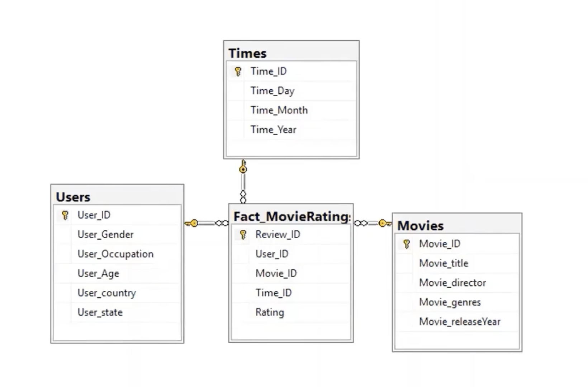

# DB Design

## ETL in SSIS
Data flow: Defines a flow of data transformations from source data to destination
Control flow: Defines the order of the data flow tasks

## Example - Analysis of Movie Ratings
Source data is an excel file containing 4 spreadsheets:
- **movies**: movieID, title, release_year
- **movie_directors**: movieID, directorName
- **movie_unique_genres**: movieID, genres
- **user_movie_ratings**: reviewID, movieID, userID, rating, date_day, date_month, date_year, age, gender, occupation, country, state

The data may contain duplicates and blank entries.

### Designing the Destination Database
First, the data warehouse for analysing users opinions to movies needs to be built.

Possible queries:
- Max rating (or min, average, count, etc.) to movies at a particular time
- Max rating (or min, average, count, etc.) given by a particular type of user

Fact table: Users ratings to movies
- 3 dimensions: movie, user, time
- 1 measure: rating

Dimension tables:
- Movie dimension
- User dimension
- Time dimension

Schema: Star

SQL scripts are then written to build a database called Movie_Rating_DB

**Figure: Movie Ratings Diagram**
