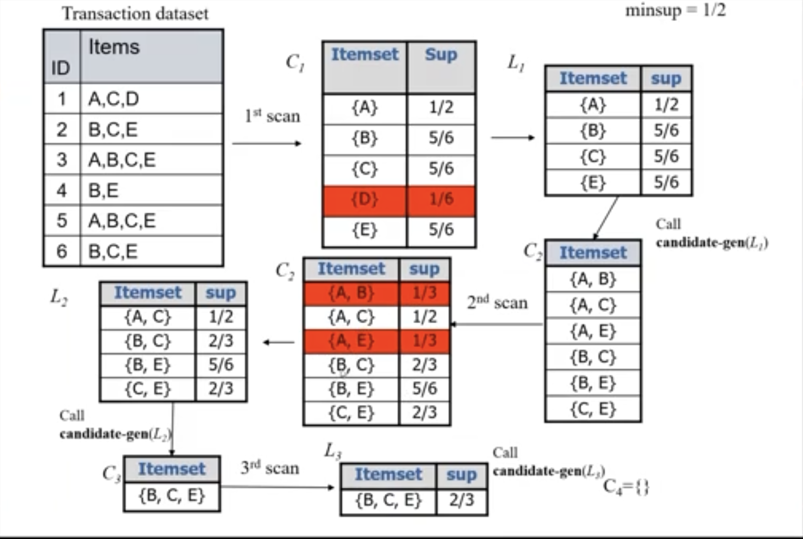

# Pattern Mining Algorithms

## Apriori Algorithm - Generating Frequent Itemsets and Rules
This algorithm can be broken down into two steps:
1. Find all frequent itemsets whose support is larger than the minimum support
2. Use the frequent itemsets to generate rules

Apriori properties:
- Any non-empty subsets of a frequent itemset must also be frequent itemsets
- Any supersets of an infequent itemset must also be infrequent (Apriori pruning principle)

```
// Input:
//   - T: Dataset
//   - ε: minsup
Apriori(T, ε)
    L1 ← {large 1 - itemsets}
    k ← 2
    while Lk−1 is not empty
        Ck ← Apriori_gen(Lk−1, k)
        for transactions t in T
            Dt ← {c in Ck : c ⊆ t}
            for candidates c in Dt
                count[c] ← count[c] + 1

        Lk ← {c in Ck : count[c] ≥ ε}
        k ← k + 1

    return Union(Lk)

Apriori_gen(L, k)
     result ← list()
     for all p ∈ L, q ∈ L where p1 = q1, p2 = q2, ..., pk-2 = qk-2 and pk-1 < qk-1
         c = p ∪ {qk-1}
         if u ∈ L for all u ⊆ c where |u| = k-1
             result.add(c)
      return result
```
_Reference: https://en.wikipedia.org/wiki/Apriori_algorithm_

  
**Figure: Apriori walkthrough**

## Generating Association Rules

```
// Input:
    - F: A set of frequent itemsets
    - minconf: The minimum confidence
// Output:
    - R: A set of association rules

R ← empty set
for each frequent itemset X in F
    for each proper non-empty subset A of X
        B ← X \ A
        if sup(X) / sup(A) ≥ minconf then
            R ← R ∪ {A -> B}
            sup(A -> B) ← sup(X)
            conf(A -> B) ← sup(X) / sup(A)

return R
```
